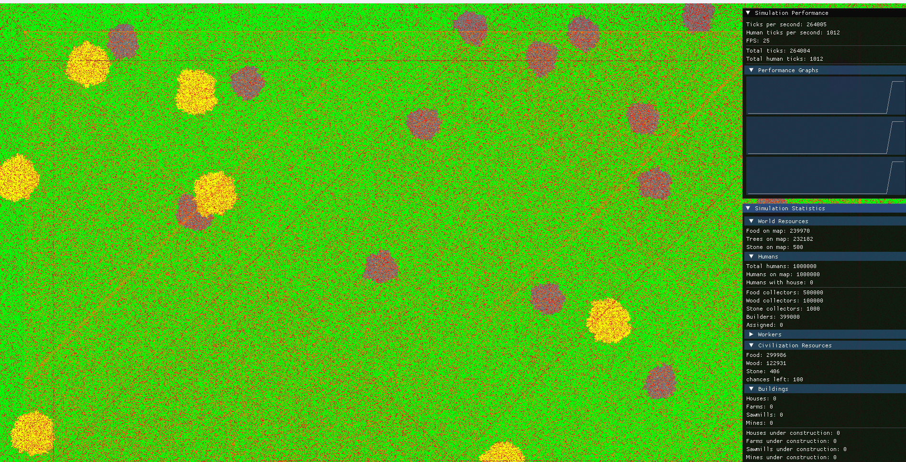
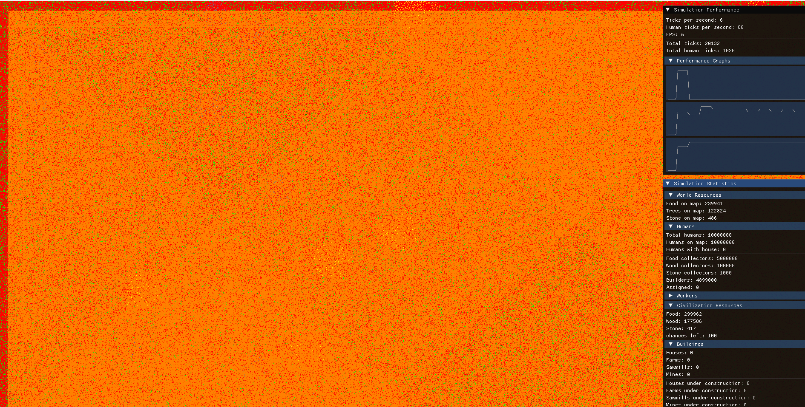
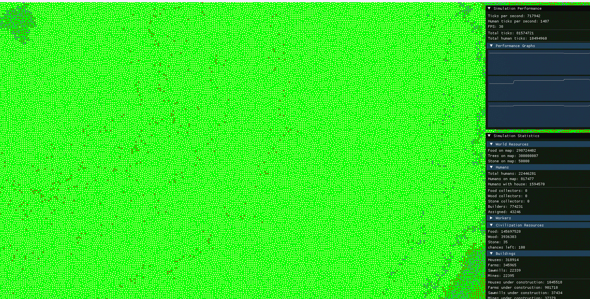
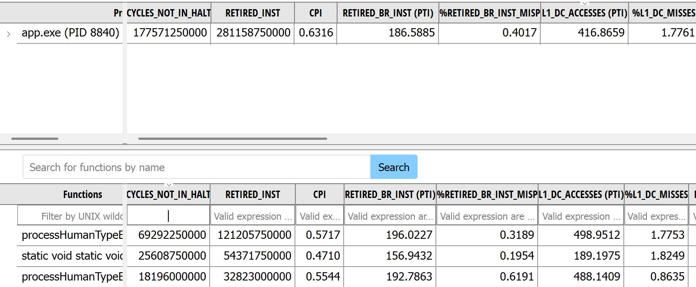
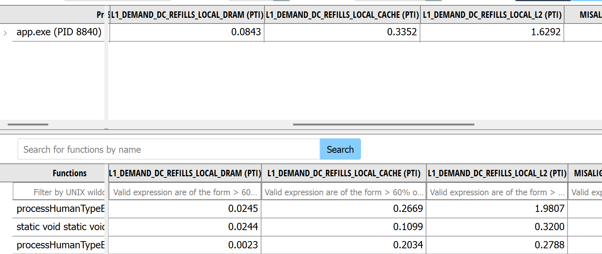
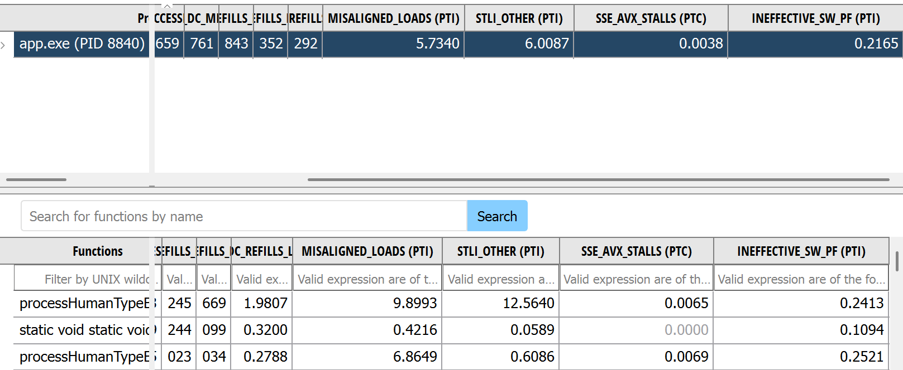

# Civilization Simulation TD

2D civilization simulation focused on high entity throughput and memory efficiency. Built in C++20 with Data-Oriented Design (SoA), bit-packed memory layouts, Intel oneTBB multithreading and SIMD.

---

# Benchmarks

### Test System Specifications:
1. Processor: AMD Ryzen 5 5500U
    - Architecture: Zen 2 (7 nm)
    - Cores / Threads: 6 cores / 12 threads
    - Clock speed: 2.10 GHz base – 4.00 GHz boost
    - Power / TDP: 15W
    - Cache:
        - L1 Cache: 384 KB (6 x 64 KB)
        - L2 Cache: 3 MB (6 x 512 KB)
        - L3 Cache: 8 MB (shared)
    - Vector Extensions: AVX, AVX2, FMA3
    - Theoretical Peak Compute: ~768 GFLOPS (FP32)

2. Graphics Card: Integrated AMD Radeon Graphics (Vega 7)
    - Shading Units / Cores: 448 ALUs (7 Compute Units)
    - Clock speed: up to 1800 MHz
    - Peak Compute: ~1.61 TFLOPS (FP32) / ~3.23 TFLOPS (FP16)
    - Memory: Shared VRAM (System RAM)

3. Memory (RAM): 16 GB LPDDR4x
    - Configuration: Dual-Channel (2x 8 GB soldered)
    - Speed: 4266 MHz / MT/s

4. System: Windows 11 Home

### Results:
1. World size: 4B tiles ~1.7 GB RAM (9 tiles = 32 bits)

2. Humans: 1M -> ~1k ticks per second (~1B human updates/s)
3. Simulation loop: hundreds of thousands ticks per second decoupled from rendering

### Photos:




### AMDuProf:




### Videos:
- [Civilization growth Benchmark Video (Streamable)](https://streamable.com/22flb5)
- [Civilization benchmark and growth 1m people 2m tiles world(Streamable)](https://streamable.com/zr8gzk)
- [World Walkthrough Video (Streamable)](https://streamable.com/ckzt01)
---

# World Architecture

1. Every Tile has 6 possible states (land, food, tree, stone, mountain, desert). Each tile is stored in 3 bits (2^3 = 8, 2 bit combinations free).
2. Every Chunk (uint32_t) contains 9 tiles (3x3 grid), taking 27 bits. The remaining 5 bits are used for:
    - 3 bits: building type placed on the chunk (none, house, farm, sawmill, mine; 3 combinations free).
    - 2 bits: flags (1 - civzone, 2 - under construction).
3. Every ChunkRegion contains 16 chunks (4x4 grid / 12x12 tiles) to group memory and speed up radius queries.
4. World stores all ChunkRegions in a contiguous 1D array allocated on the heap.

---

# Humans & Agent Logic

### 1. Data Layout
Agents are split into 5 Structure of Arrays (SoA) pools:
- foodCollectors
- woodCollectors
- stoneCollectors
- builders
- assigned (workforce inside completed buildings)

### 2. Navigation & Boundaries
- builders and assigned move strictly within civzone bounds (North, South, East, West).
- foodCollectors and woodCollectors move within civzone + an offset range defined in the config.
- stoneCollectors target the center of random precalculated mountain ranges.
- Movement direction without a target (target == UINT16_MAX):
    - Agent points determine direction.
    - Last 3 bits of points (points & 7) give the direction index (0 to 7).
    - Direction vectors are read from lookup tables (lookupX[dirIndex], lookupY[dirIndex]).
    - Points are decremented when hitting borders to turn the agent back into bounds.

### 3. Amortized Radius Search
Running radius search for 1,000,000 agents every tick is a bottleneck (1B updates/s). Search frequency is adjusted by entity type and density:
- Resource Collectors: Resources are dense. Collectors only check the chunk they currently stand on (r = 1). Radius search runs once every 3 movement steps (average time to cross a 3x3 chunk).
- Builders & Assigned: Buildings are sparse. Agents check all chunks and flags inside their current ChunkRegion. Runs once every 12 movement steps (average time to cross a 4x4 chunk region).

### 4. Multithreading & Update Pipeline
Agents are updated in a parallel loop to avoid invoking oneTBB every single step:
1. Decision phase: check if the agent type performs a radius search; verify zone bounds (out of bounds resets target to civSpawn).
2. Direction phase: calculate direction from lookup table and apply movement.
3. Collection phase: agents write collected resources to thread-local dirty buffers without locks (dirtyBuffer[threadID].push_back(), foodCollected[threadID]++).
4. Boundary check: decrement points if crossing allowed boundaries.
5. Micro-sync (Builders & Assigned): builders completing buildings and assigned agents reaching their targets undergo step-level synchronization. This prevents index invalidation (vector erasures) and duplicate building construction.
6. Global sync: merge all thread-local dirty buffers into global simulation counters and handle type swaps.

Data race notes: Resource counts clamp to 0 on underflow. Because major production comes from completed buildings, minor collection discrepancies under heavy agent density do not disrupt simulation balance.

---

# Thread Division & Rendering

Config option readDeviceThreadCount = true allocates 1 core to the simulation loop and all remaining cores to the human loop.

### Simulation Loop (Core 0):
- SFML window and ImGui handling.
- Spawning world resources.
- High-level civilization decisions (expansion, placement).
- Dirty-tile world rendering (reloads view every 5s to clear visual artifacts).

### Human Loop (Cores 1..N):
- Continuously executes human update pipeline via oneTBB.

### Rendering Synchronization:
- Humans are rendered on a separate layer.
- Ring buffer approach was dropped due to high memory overhead and desynchronization (humans can run 1000 ticks in one render frame).
- The engine uses handshake flags: human sync does not erase/swap vectors while the renderer reads, and the renderer skips agent frames during active compaction.

---

# Implementation Insights & Emergent Behavior

### 1. Custom Threadpool vs oneTBB Dispatch Batching
A custom threadpool was initially built to eliminate the invocation and scheduling overhead of oneTBB when spinning loops thousands of times per second. 
However, batching multiple simulation steps inside a single parallel iteration (parallel_for { for(0..N) { logic } }) drastically cut scheduling overhead. With batched steps, oneTBB proved significantly faster due to its work-stealing scheduler, making the custom threadpool redundant.

### 2. Emergent Clustering and Geometric Patterns
In the benchmarks, humans visibly form lines, streams, and dense clusters. This is not the result of a flocking/Boids algorithm, nor an artificial coordinate clone:
- 8-Directional Lookup: Discrete heading selection (points & 7) naturally aligns agents moving along the same axes.
- Spatial Attractors: Hard rules, such as resetting targets to civSpawn when wandering out of bounds, funnel thousands of agents through identical geographic corridors.
- Search Efficiency vs Random Noise: Replacing direction logic with a randomized hash (dir = hash(rand)) was tested and rejected. Pure random walks cause Brownian motion, making agents jitter in place and severely hurting resource collection throughput.
- Cache Locality: While unintentional, this mathematical clustering keeps active entity coordinates geographically concentrated, which improves CPU cache hit rates during chunk and tile accesses.

### 3. Why Full SoA and uint16_t? (SIMD Vectorization)
In standard game architecture, SoA is often used so the renderer can read only `pos_x` and `pos_y` without pulling entire entity structs into cache. However, the simulation loop reads nearly all agent fields on every tick anyway, meaning memory bandwidth savings alone did not justify a pure SoA layout.

The actual reason for pure SoA is SIMD vectorization:
- Contiguous SIMD Loads: Vectorizing update loops requires flat contiguous arrays for each component. In an Array of Structures (AoS), loading packed data into AVX2 registers requires expensive gather instructions or shuffle/unpack overhead.
- Throughput of uint16_t vs uint32_t: Coordinates and points were intentionally switched from 32-bit integers to `uint16_t`. A single 256-bit AVX2 vector register fits 16 elements of 16-bit integers (`epi16`), compared to only 8 elements of 32-bit integers (`epi32`). This effectively doubles instruction throughput across agent batch processing loops.

### 4. Compile-Time Optimization (configconstexpr)
Parameters in configconstexpr are defined as compile-time constants so the compiler can optimize integer division and modulo operations into cheap bit-shifts and multiplication by reciprocals.

---

# Civilization Mechanics

- The Civilization class manages building placement, worker requirements, and expansion logic.
- Hunger mechanics: every X ticks, all agents consume food (humansCount * foodForHuman). If food is insufficient, civilization life chances decrease. When reaching 0, the civilization dies.
- Building costs, production yields, spawn rates, and hunger intervals are configurable.

---

# System Features (Windows Only)

- Low-Level Windows API: Used for thread affinity and crash handling.
- Thread Pinning: Worker threads are pinned to physical cores to minimize context switching and keep L1/L2 cache locality.
- Custom Crash Handler: Catches low-level exceptions without an active debugger attached (debuggers change thread timing and mask race conditions).
- SIMD: AVX2 instructions are used for batch operations; test suite validates SIMD edge cases.
- Allocator: Uses mimalloc for low-latency multithreaded heap allocations.

---

# Controls

- Camera movement: `W`, `S`, `A`, `D`

---

# Dependencies

- Intel oneTBB
- SFML
- Dear ImGui
- mimalloc

---

# Build

Requirements:
- Windows 10/11
- CPU with AVX2 support
- C++20 compatible compiler (MSVC / Clang)
- CMake 3.20+

```powershell
cmake --preset release
cmake --build --preset release
./build/release/app.exe
